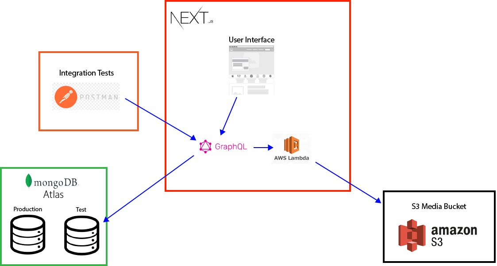

# Upwork Proposal Brooklyn NY V4

https://upwork-proposal-brooklyn-ny-v4-4ohnbh3l2.vercel.app/

This project is a web application built to satisfy a proposal I found while browsing job postings on Upwork. The client wanted the following:
- Users can create forms 
- Users can share those forms with anyone they want.
- Users can store media
- Users can stream media
- Users can share their media with anyone they want.
  
This type of web application requires knowledge of a lot of techniqus and skills I believe to be fundamental in a senior web engineers arsenal. I want this project to serve as evidence of my skill level. This way, no one will have to "gamble" on whether or not I can contribute to their team. I want to give them a peace of mind.

## Architecture

The project is built primarily with NextJS. This was the best decision we could have made. Development has been a piece of cake, leaving more time to configure our many external services (Atlas, S3, Lambda, etc.)

### User Interface
Our front-end development only works with GraphQL and React. This keeps things simple in case we need to bring on extra help. Keeping the bar low will make it easier to find qualified help if needed.

### Database
We love MongoDB. We're using the cloud provider they offer called Atlas. Simple Setup. In our application we have the notion of first-class citizens. There are three:
- Users
- Forms
- FormElements

**FormElements** are basically the questions, titles, labels, etc. that make up a Form. FormElements can be re-used in other forms, so they are purposefully not coupled to any particular forms.

**Forms** are similar, in that a single form can be edited by multiple users. As long as a user is authorized, they can edit a form.

**Users** are first-class citizens by default for authorization purposes. We use AWS Cognito to authenticate users. Once a new user is registed in AWS Cognito, we use a lambda function to consume the registration, and create the new user in our Atlas Cloud MongoDB database (PENDING).

### Media Streaming
We use *GraphQL Resolvers* to process requests from our front-end to stream media from our S3 media bucket. The resolvers decide if the user is authorized to view the media, and subsequently either provide the URL to the media (200), or reject the request (404);